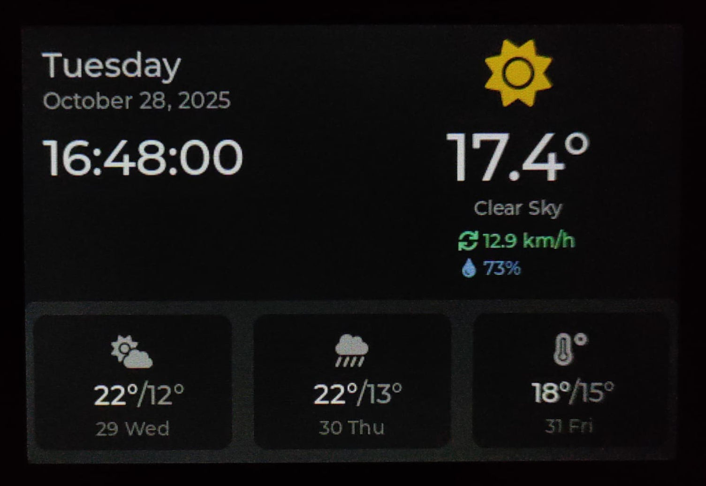

# CloudMouse Weather Station Example

🌤️ **Real-time weather station powered by CloudMouse SDK + LVGL + Open-Meteo API**

A complete weather monitoring application that demonstrates advanced CloudMouse SDK features including service architecture, event-driven communication, and pixel-perfect LVGL UI design.



## 📋 Overview

This example showcases a production-ready weather station application built on the CloudMouse SDK. It features:

- **Live weather data** from Open-Meteo API (free, no API key required)
- **3-day forecast** with detailed temperature and conditions
- **Auto-refresh** every 15 minutes
- **Beautiful LVGL UI** with Font Awesome weather icons
- **Dual-core architecture** for smooth 30Hz UI rendering
- **Clean service separation** with event-driven communication

## 📋 Features

### Weather Display
- 🌡️ **Current temperature** with decimal precision
- 💧 **Humidity percentage** with water drop icon
- 💨 **Wind speed** in km/h
- 🌤️ **Weather condition** with Font Awesome icons
- 📅 **3-day forecast** with min/max temperatures
- 🕐 **Real-time clock** with date display

### Technical Features
- ⚡ **Event-driven architecture** - Clean separation between Core and UI
- 🔄 **Automatic updates** - Fetches weather every 15 minutes
- 🌐 **WiFi management** - Auto-connect with fallback to AP mode
- 🎨 **LVGL 9.x UI** - Smooth animations and modern design
- 📦 **Service pattern** - Reusable WeatherService component
- 🔒 **Thread-safe** - Dual-core communication via FreeRTOS queues

## 🔧 Hardware Requirements

- **CloudMouse device** (ESP32-based)
  - ESP32 with dual-core support
  - ILI9488 display (480x320)
  - Rotary encoder
  - NeoPixel LED ring
  - WiFi connectivity


## 🔧 Compatibility

**Arduino IDE** - out-of-the-box.
**Platformio** - with source code switching (see below!).

### Important: Source Code Switching

> ⚠️ The project maintains a single codebase that works with both Arduino IDE and PlatformIO. The `src/main.cpp` file is kept in sync but needs to be toggled:

**To use PlatformIO:**
1. Open `src/main.cpp` in your editor
2. **Uncomment the entire file**
3. Save and build with PlatformIO

**To switch back to Arduino IDE:**
1. Open `src/main.cpp` in your editor
2. **Re-comment the entire file**
3. Save and build with Arduino IDE

> 💡 **Pro tip**: Most editors support block comment toggling with `Ctrl+/` (Windows/Linux) or `Cmd+/` (Mac). Select all (`Ctrl+A`) then toggle comments!


## 📚 Prerequisites

Before using this example, make sure you have:

1. **CloudMouse SDK** - Base SDK with hardware abstraction layer
   - 📖 [CloudMouse SDK Repository](https://github.com/tibonilab/cloudmouse-boilerplate)
   
2. **LVGL Library** - Graphics library (v9.x recommended)
   - 📖 [LVGL Official Documentation](https://docs.lvgl.io/)
   - Install via Arduino Library Manager: `LVGL`

3. **ArduinoJson** - JSON parsing library
   - Install via Arduino Library Manager: `ArduinoJson`

4. **HTTPClient** - Included with ESP32 Arduino Core

## 🚀 Setup Instructions

### 1. Install Dependencies

Install the following libraries via Arduino Library Manager:
- `LVGL` (v9.x)
- `ArduinoJson` (v7.x)

### 2. Configure LVGL

**IMPORTANT:** You need to add the `lv_conf.h` configuration file to your Arduino libraries folder.

**Location:**
```
~/Arduino/libraries/lv_conf.h
```

**Content:**
```cpp
#ifndef LV_CONF_H
#define LV_CONF_H

#define LV_COLOR_DEPTH 16
#define LV_COLOR_16_SWAP 1
#define LV_MEM_SIZE (48U * 1024U)

// Enable required fonts
#define LV_FONT_MONTSERRAT_14 1
#define LV_FONT_MONTSERRAT_16 1
#define LV_FONT_MONTSERRAT_20 1
#define LV_FONT_MONTSERRAT_24 1
#define LV_FONT_MONTSERRAT_36 1
#define LV_FONT_MONTSERRAT_48 1

#define LV_FONT_DEFAULT &lv_font_montserrat_14
#define LV_TXT_ENC LV_TXT_ENC_UTF8

#define LV_TICK_CUSTOM 1
#define LV_TICK_CUSTOM_INCLUDE "Arduino.h"
#define LV_TICK_CUSTOM_SYS_TIME_EXPR (millis())

// Enable widgets
#define LV_USE_LABEL 1
#define LV_USE_ARC 1
#define LV_USE_BAR 1
#define LV_USE_FLEX 1
#define LV_USE_GRID 1
#define LV_USE_PSRAM 1

#endif
```

### 3. Set Your Location

Edit the main `.ino` file to set your location coordinates:

```cpp
// Change these to your location (example: east coast center Italy)
WeatherService weatherService(43.9395805, 12.7710328);
```

**How to find your coordinates:**
- Visit [https://www.latlong.net/](https://www.latlong.net/)
- Search for your city
- Copy the latitude and longitude values

### 4. Upload

1. Open the `.ino` file in Arduino IDE
2. Select your ESP32 board
3. Upload the sketch
4. Connect to WiFi when prompted (AP mode will start if no credentials saved)

## 🏗️ Architecture

This example follows a clean service-oriented architecture:

```
┌─────────────────────────────────────────────────┐
│           Main Application (.ino)               │
│  Creates instances and registers with Core      │
└────────────┬────────────────────────────────────┘
             │
    ┌────────▼─────────┐
    │      Core        │ ◄─── Event Bus (FreeRTOS Queues)
    │   (Core 0)       │
    └─┬──────────────┬─┘
      │              │
      │              │
┌─────▼──────────┐  ┌───▼────────────┐
│ WeatherService │  │ DisplayManager │
│   (Core 0)     │  │   (Core 1)     │
│                │  └───┬────────────┘
│ - API calls    │      │
│ - JSON parsing │  ┌───▼──────────┐
│ - Data storage │  │  WeatherUI   │
│ - Auto-refresh │  │   (LVGL)     │
└────────────────┘  └──────────────┘
```

### Key Components

**Core 0 (Logic):**
- `Core` - System coordinator and event processor
- `WeatherService` - API integration and data management
- `WiFiManager` - Network connectivity
- `WebServerManager` - Configuration portal

**Core 1 (UI):**
- `DisplayManager` - LVGL integration and screen management
- `WeatherUI` - Weather-specific UI components and rendering
- `EncoderManager` - User input handling

## 📖 Key Files

| File | Description |
|------|-------------|
| `cloudmouse-example-meteo-station.ino` | Main application entry point |
| `lib/services/WeatherService.h/cpp` | Weather API integration service |
| `lib/ui/WeatherUI.h/cpp` | Weather UI component with LVGL |
| `lib/hardware/DisplayManager.h/cpp` | Display driver and event handling |
| `lib/core/Core.h/cpp` | System coordinator and state machine |
| `font_awesome_fonts.h` | Font Awesome icon declarations |
| `assets/font_awesome_solid_*.c` | Font Awesome icon definitions |

## 🎯 Features Demonstrated

### Service Architecture
- **WeatherService** - Standalone service for weather data
- **Event-driven communication** - Zero coupling between components
- **Data serialization** - Efficient data transfer via events
- **Automatic updates** - Background refresh every 15 minutes

### LVGL Integration
- Custom display driver for ILI9488 via LovyanGFX
- Font Awesome icon integration for weather symbols
- Responsive layout with flexbox positioning
- PSRAM buffer allocation for optimal performance
- Real-time clock updates (1Hz)

### Event Handling
- `WEATHER_DATA_CURRENT` - Current weather updates
- `WEATHER_DATA_FORECAST` - Daily forecast updates
- `DISPLAY_UPDATE` - UI refresh triggers
- `WIFI_CONNECTED` - Network state changes
- Thread-safe dual-core communication

## 🌐 API Integration

This project uses the free [Open-Meteo API](https://open-meteo.com/):

**Endpoint:**
```
https://api.open-meteo.com/v1/forecast
```

**Parameters:**
- `latitude` / `longitude` - Your location
- `current` - temperature_2m, relative_humidity_2m, weather_code, wind_speed_10m
- `daily` - weather_code, temperature_2m_max, temperature_2m_min
- `timezone` - auto (uses location timezone)
- `forecast_days` - 4 (today + 3 days forecast)

**No API key required!** ✨

## 🎨 Weather Icons

Weather conditions are displayed using Font Awesome Solid icons:

| Icon | Condition | WMO Code |
|------|-----------|----------|
| ☀️ | Clear Sky | 0 |
| 🌤️ | Partly Cloudy | 1-3 |
| ☁️ | Cloudy | 4-8 |
| 🌫️ | Foggy | 45-48 |
| 🌧️ | Rainy | 51-67 |
| ❄️ | Snowy | 71-77 |
| ⛈️ | Thunderstorm | 95-99 |

Font Awesome fonts were converted using the [LVGL Font Converter](https://lvgl.io/tools/fontconverter).

## 📱 User Interface

### Layout

```
┌─────────────────────────────────────────────┐
│  Date & Time         Current Weather        │
│  Monday              [☀️]                   │
│  October 27, 2025    24.5°                  │
│  14:30:45            Clear Sky              │
│                      💧 65%  💨 12 km/h     │
├─────────────────────────────────────────────┤
│  [Day 1]        [Day 2]        [Day 3]      │
│  ☀️              🌤️             ☁️          │
│  28° / 18°      26° / 17°      22° / 15°    │
│  28 Tue         29 Wed         30 Thu       │
└─────────────────────────────────────────────┘
```

### Color Scheme

- Background: Dark gray (#1a1a1a)
- Text: White (#ffffff)
- Secondary text: Light gray (#888888)
- Weather icon: Orange (#ffaa00)
- Humidity: Blue (#4da6ff)
- Wind: Green (#66ff99)

## 🔄 Update Cycle

1. **Initial boot** - Weather data fetched immediately after WiFi connection
2. **Periodic updates** - Auto-refresh every 15 minutes
3. **Manual refresh** - Can be triggered via serial commands
4. **UI updates** - Real-time clock updates every second

## 🛠️ Customization

### Change Location

Edit the coordinates in the main `.ino` file:

```cpp
WeatherService weatherService(YOUR_LATITUDE, YOUR_LONGITUDE);
```

### Change Update Interval

Modify the interval in `WeatherService.cpp`:

```cpp
updateInterval(900000)  // Change from 900000ms (15 min) to your preference
```

Or use the setter:

```cpp
weatherService.setUpdateInterval(600000);  // 10 minutes
```

### Customize UI Colors

Edit colors in `WeatherUI.cpp`:

```cpp
lv_color_hex(0x1a1a1a)  // Background color
lv_color_hex(0xFFAA00)  // Icon color
// etc...
```

### Add New Weather Data

1. Add fields to `WeatherData` struct in `WeatherService.h`
2. Parse new fields in `WeatherService::fetchWeather()`
3. Add to serialization in `WeatherService::notifyWeatherUpdate()`
4. Update parsing in `DisplayManager::processEvent()`
5. Add UI elements in `WeatherUI::updateCurrentWeather()`

## 🐛 Troubleshooting

### WiFi Not Connecting
- Check SSID and password
- Ensure 2.4GHz WiFi (ESP32 doesn't support 5GHz)
- Try clearing saved credentials via serial: `clear_prefs`

### Weather Data Not Updating
- Check serial monitor for API errors
- Verify internet connection
- Ensure coordinates are valid
- Check Open-Meteo API status

### Display Issues
- Verify `lv_conf.h` is properly configured
- Check Font Awesome `.c` files are in project root
- Ensure PSRAM is enabled in Arduino IDE: `Tools > PSRAM > Enabled`

### Compilation Errors
- Install all required libraries
- Check library versions (LVGL 9.x, ArduinoJson 7.x)
- Ensure Font Awesome files are in project root

## 📊 Memory Usage

Approximate memory footprint:

- **Flash:** ~1.2MB (program + LVGL + fonts)
- **SRAM:** ~45KB (heap + stack)
- **PSRAM:** ~60KB (LVGL buffers)

The dual-core architecture keeps UI rendering smooth at 30Hz while background tasks run independently.

## 🔗 Useful Links

- [CloudMouse website](https://cloudmouse.co)
- [CloudMouse SDK](https://github.com/tibonilab/cloudmouse-boilerplate)
- [LVGL Documentation](https://docs.lvgl.io/)
- [Open-Meteo API](https://open-meteo.com/)
- [Font Awesome Icons](https://fontawesome.com/)
- [LVGL Font Converter](https://lvgl.io/tools/fontconverter)
- [ESP32 Arduino Core](https://github.com/espressif/arduino-esp32)

## 📝 License

This example follows the same license as the CloudMouse SDK.

## 🤝 Contributing

Contributions are welcome! Feel free to:
- Report bugs via issues
- Submit pull requests for improvements
- Share your customizations
- Suggest new features

## 🙏 Credits

- **CloudMouse SDK** by [Tiboni Lab](https://github.com/tibonilab)
- **LVGL** by [LVGL LLC](https://lvgl.io/)
- **Open-Meteo API** by [Open-Meteo](https://open-meteo.com/)
- **Font Awesome** by [Fonticons, Inc.](https://fontawesome.com/)

---

Made with ❤️ and ☕ by the CloudMouse community

**🌤️ Enjoy your weather station!**
